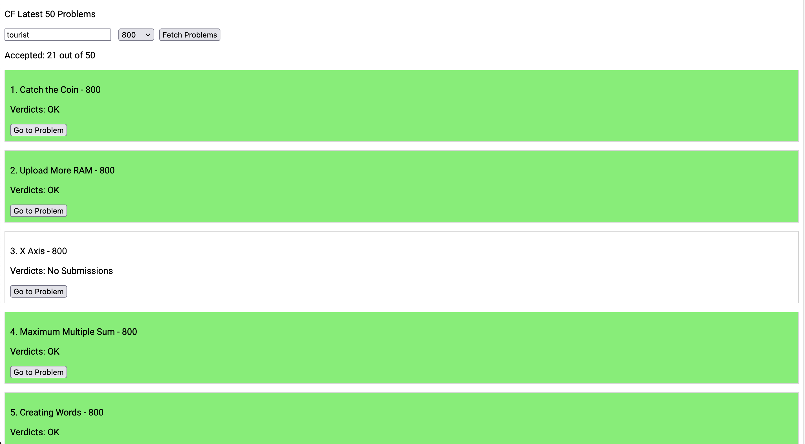

# CF Latest 50 Problems

A simple web application to fetch the latest 50 problems from Codeforces based on user rating.

## Features

- Fetch and display the latest 50 problems from Codeforces.
- Filter problems by user rating.
- Show accepted problems count for a given user.

## Usage

Enter your Codeforces handle, select your desired problem rating, and click on "Fetch Problems" to see the latest problems.

## Demo

